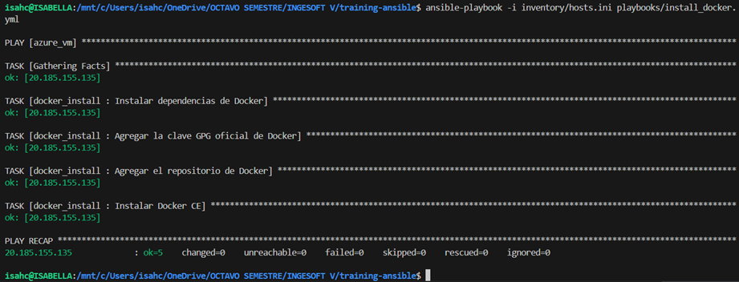
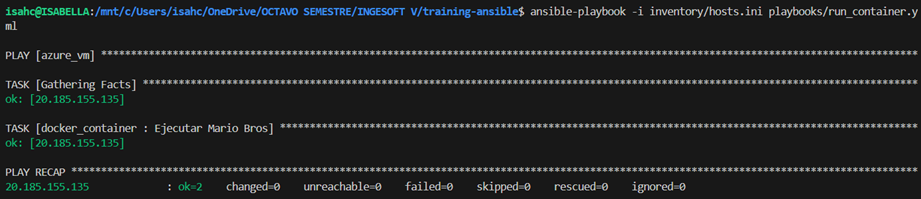
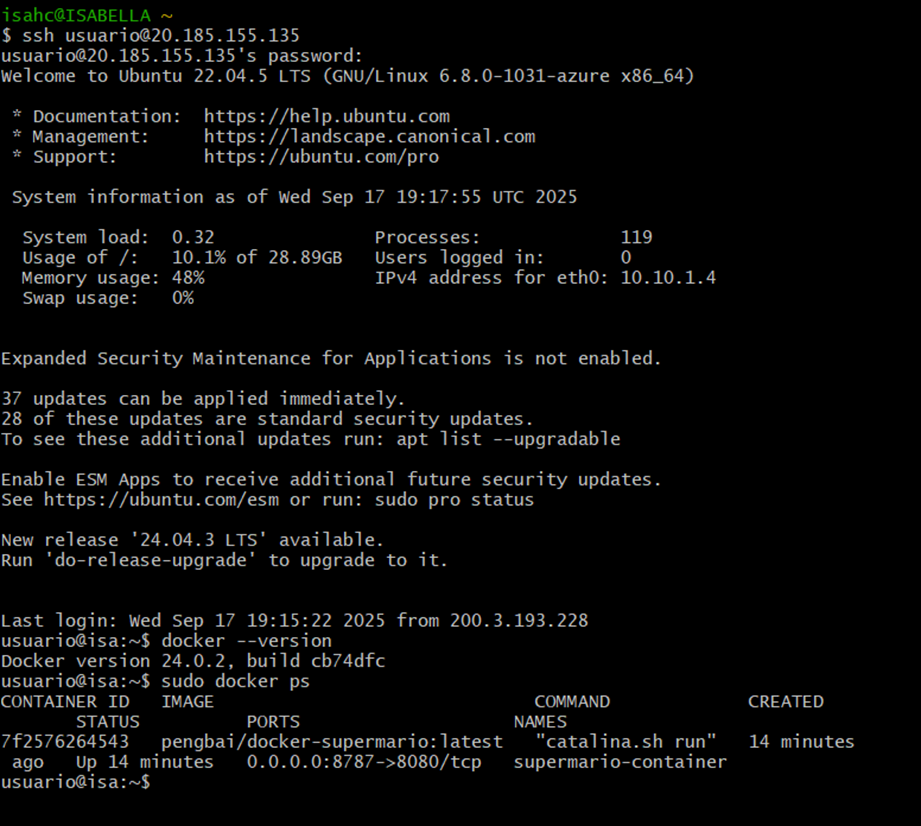
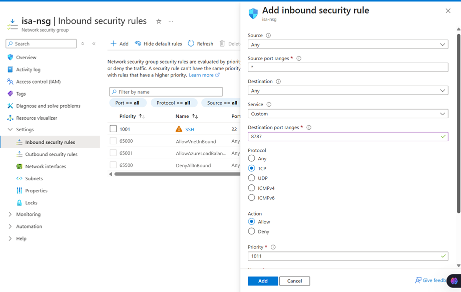

### Nombre Isabella Huila
### Código A00394751


## Configuración del entorno

### 1. Instalar WSL (Windows)
```powershell
wsl --install -d Ubuntu
````

### 2. Actualizar paquetes en WSL

```bash
sudo apt update && sudo apt upgrade -y
```

### 3. Instalar Ansible

```bash
sudo apt install ansible -y
```

### 4. Instalar `sshpass` (para conexión con contraseña)

```bash
sudo apt install sshpass -y
```

---

##  Comandos principales

### 1. Verificar instalación de Ansible

```bash
ansible --version
```


### 3. Ejecutar playbook para instalar Docker

```bash
ansible-playbook -i inventory/hosts.ini playbooks/install_docker.yml


```

### 4. Ejecutar playbook para correr un contenedor

```bash
ansible-playbook -i inventory/hosts.ini playbooks/run_container.yml
```



---

## Notas

* Utilice **WSL con Ubuntu** como entorno de trabajo.
* `sshpass` se utilizó para conectarse a la máquina virtual de Azure usando usuario/contraseña.


## Verificación de la imagen en docker 


## Configuración de la máquina en azure:



### Resultado
Docker se instaló y configuró exitosamente en la máquina virtual.El contenedor fue desplegado y está disponible a través de la dirección pública de la VM en el puerto configurado.
La conectividad fue verificada gracias a la apertura del puerto 8787 en el grupo de seguridad de red (NSG).